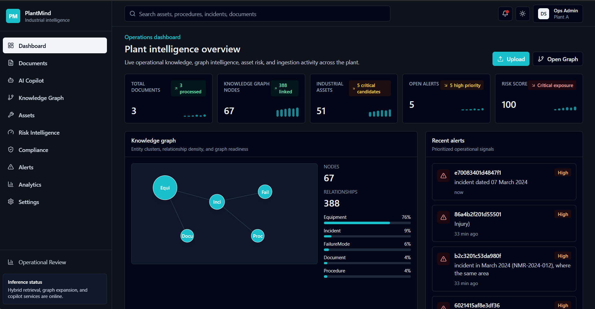
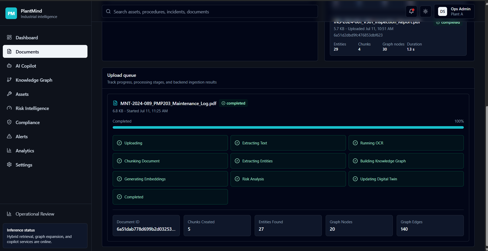
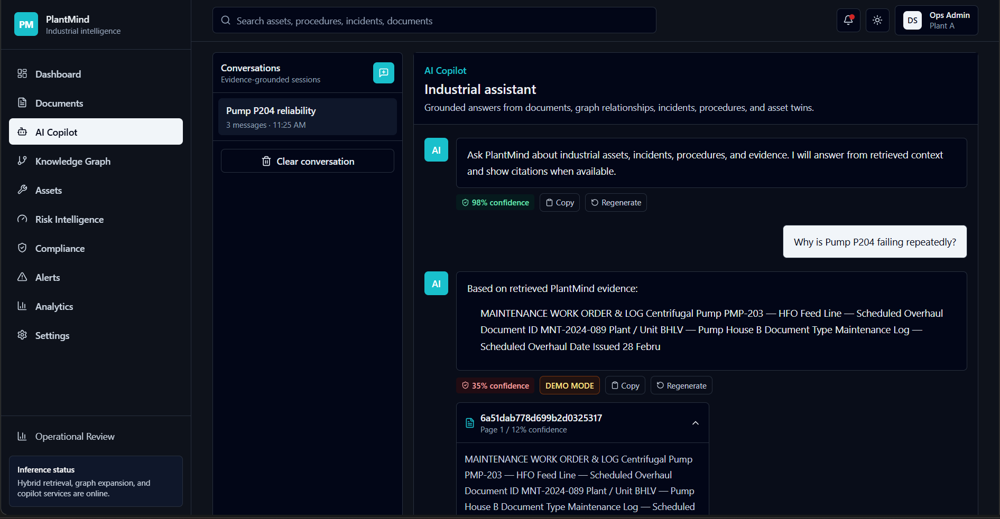
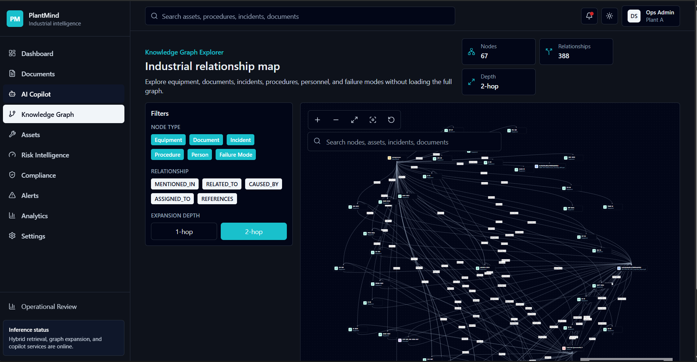
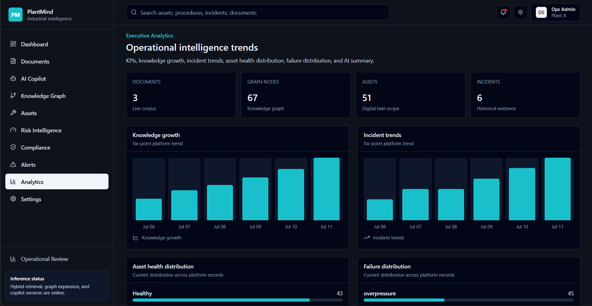
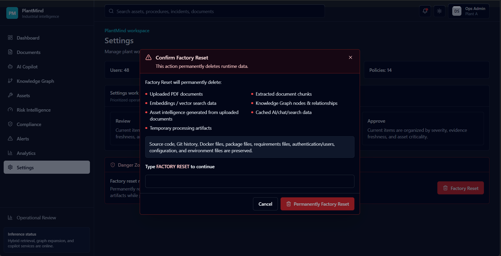

<div align="center">

# 🌿 PlantMind

### AI-Powered Industrial Knowledge Intelligence Platform

Transform industrial PDFs into searchable operational intelligence with AI-powered ingestion, hybrid retrieval, knowledge graphs, citation-aware copilot answers, analytics dashboards, and demo-safe factory reset.




</div>

## Contents

- [Overview](#overview)
- [Problem Statement](#problem-statement)
- [Highlights](#-highlights)
- [Key Features](#key-features)
- [Architecture](#architecture)
- [Technology Stack](#technology-stack)
- [Project Structure](#project-structure)
- [Getting Started](#getting-started)
- [Environment Variables](#environment-variables)
- [How to Run](#how-to-run)
- [API Overview](#api-overview)
- [Screenshots](#screenshots)
- [Demo Workflow](#demo-workflow)
- [Factory Reset](#factory-reset)
- [Roadmap](#-roadmap)
- [Team / Author](#team--author)
- [License](#license)

## Overview

Industrial teams often need to reason across maintenance reports, inspection records, procedures, incident narratives, equipment history, and lessons learned. PlantMind gives those documents a working interface:

1. PDF files are uploaded into a backend ingestion pipeline.
2. Text is extracted, chunked, embedded, and converted into graph context.
3. Operators can search evidence, inspect relationships, and ask a copilot grounded in retrieved document chunks.
4. Dashboards summarize risk, compliance, alerts, executive analytics, and asset health views.
5. A guarded Factory Reset clears runtime demo data so the same environment can be reused for judging or demos.

The codebase is organized as a monorepo with a Python API, TypeScript frontend, Docker Compose infrastructure, and architecture notes under `docs/`.

## Problem Statement

Plant knowledge is usually scattered across static PDFs, work orders, inspection reports, and incident documents. During operational reviews or abnormal events, teams need fast answers with traceable evidence, not just keyword matches. PlantMind addresses this by combining document ingestion, hybrid retrieval, graph context, and citation-aware chat into one plant intelligence workspace.

## 🚀 Highlights

- 📄 **Intelligent PDF Ingestion**: Multi-file PDF upload with validation, pipeline progress states, and upload history.
- 🔎 **Hybrid Semantic Search**: Evidence retrieval with graph context, ranking, confidence scoring, and Redis caching.
- 🤖 **AI Copilot**: Retrieval-grounded chat with citations, conversation memory, fallback evidence answers, and follow-up prompts.
- 🕸️ **Knowledge Graph Explorer**: React Flow graph exploration with search, filters, node expansion, node drawer, and analytics.
- 🏭 **Digital Asset Twin**: Asset-specific digital twin view backed by API services and tests.
- 📊 **Executive Analytics**: Operational analytics, risk, compliance, alerts, and dashboard views.
- ⚠️ **Risk Dashboard**: Risk intelligence endpoint and frontend dashboard for operational review.
- 🧹 **Factory Reset**: Guarded reset workflow that clears runtime demo data while protecting source files.

## Key Features

Only features implemented in this repository are listed here.

| Area | Implemented capability |
| --- | --- |
| **Document ingestion** | Multi-PDF upload UI, PDF validation, size limit enforcement, persistent file storage, document records, text/chunk/entity/graph/embedding pipeline hooks, upload history, retry/cancel UI states |
| **Hybrid search** | `/api/v1/search/query` endpoint using a `HybridRetriever`, evidence ranking, graph context, confidence score, and Redis response caching |
| **AI copilot** | Chat endpoint with conversation memory, retrieval-grounded prompt construction, Gemini client integration, citation resolution, fallback evidence answers, follow-up questions, and related assets |
| **Knowledge graph explorer** | Graph overview, node search, subgraph loading, equipment context, graph analytics, React Flow canvas, filters, search, node drawer, neighbor highlighting, and analytics sidebar |
| **Asset digital twin** | Asset-specific digital twin route and frontend page for `/assets/:assetId`, backed by asset services and tests |
| **Dashboards** | Main dashboard, risk dashboard, compliance dashboard, alerts dashboard, and executive analytics frontend routes backed by API services |
| **Factory Reset** | Settings UI danger zone and `DELETE /api/v1/admin/factory-reset` endpoint that clears runtime MongoDB collections, Neo4j graph data, Redis cache keys, uploaded files, and temporary processing folders |
| **App shell** | React Router workspace, lazy-loaded feature pages, TanStack Query caching, Zustand app store, dark mode support, offline banner, toast notifications, and error boundaries |
| **Infrastructure** | Docker Compose services for API, web, MongoDB, Neo4j with APOC, and Redis |
| **Tests** | Backend tests for chat copilot, document pipeline, hybrid search, graph explorer, dashboard, risk dashboard, asset digital twin, and factory reset |

## Architecture

```text
┌──────────────────────────────────────────────────────────────────────────────┐
│                                  PlantMind                                   │
└──────────────────────────────────────────────────────────────────────────────┘

  ┌──────────────────────────────┐
  │ React + Vite Web Workspace   │
  │ http://localhost:5173        │
  │                              │
  │ Documents · Graph · Copilot  │
  │ Risk · Compliance · Alerts   │
  │ Analytics · Settings         │
  └───────────────┬──────────────┘
                  │ REST /api/v1
                  ▼
  ┌──────────────────────────────┐
  │ FastAPI Backend              │
  │ http://localhost:8000        │
  │                              │
  │ Routes · Services · Agents   │
  │ Workflows · AI Integrations  │
  └───────┬──────────┬───────────┘
          │          │
          │          ├─────────────────────────────┐
          │          │                             │
          ▼          ▼                             ▼
  ┌────────────┐ ┌────────────┐             ┌────────────┐
  │ MongoDB    │ │ Neo4j      │             │ Redis      │
  │ metadata   │ │ knowledge  │             │ cache and  │
  │ chunks     │ │ graph      │             │ memory     │
  └────────────┘ └────────────┘             └────────────┘
          │
          ▼
  ┌──────────────────────────────┐
  │ Uploaded PDF Storage         │
  │ DOCUMENT_STORAGE_ROOT        │
  └──────────────────────────────┘
```

### Backend Flow

- `apps/api/app/api/v1/routes/` exposes versioned FastAPI routes.
- `apps/api/app/domain/` defines Pydantic request and response schemas.
- `apps/api/app/services/` contains application services for search, chat, dashboards, graph explorer, assets, ingestion support, and reset logic.
- `apps/api/app/db/` contains MongoDB, Neo4j, and Redis adapters.
- `apps/api/app/agents/` and `apps/api/app/workflows/` contain ingestion and workflow orchestration.

### Frontend Flow

- `apps/web/src/app/App.tsx` defines the main route tree.
- Feature modules live under `apps/web/src/features/`.
- Shared layout and reusable UI helpers live under `apps/web/src/components/`.
- API base URL configuration lives in `apps/web/src/lib/api-client.ts`.

## Technology Stack

| Group | Technologies |
| --- | --- |
| **Frontend** | React 19, TypeScript, Vite 6, React Router 7, TanStack Query 5, Zustand, Tailwind CSS, Framer Motion |
| **Backend** | Python, FastAPI, Uvicorn, Pydantic v2, Pydantic Settings |
| **AI** | Google Generative AI client, LangGraph, LangChain Core, embedding/entity/citation service modules |
| **Databases** | MongoDB, Neo4j 5 Community with APOC, Redis |
| **Document Processing** | `pdfplumber`, `PyPDF2`, `python-multipart` |
| **UI / Visualization** | Radix UI primitives, Lucide icons, React Flow (`@xyflow/react`), React Markdown, Highlight.js |
| **DevOps** | Docker Compose, custom API and web Dockerfiles |
| **Testing** | Pytest, pytest-asyncio, Ruff, MyPy, ESLint, TypeScript compiler |

## Project Structure

```text
PlantMind
├─ apps
│  ├─ api
│  │  ├─ app
│  │  │  ├─ api/v1/routes       FastAPI route modules
│  │  │  ├─ agents              ingestion and intelligence agents
│  │  │  ├─ core                config and logging
│  │  │  ├─ db                  MongoDB, Neo4j, Redis adapters
│  │  │  ├─ domain              Pydantic schemas and domain types
│  │  │  ├─ services            business and AI services
│  │  │  └─ workflows           ingestion workflow orchestration
│  │  ├─ data/documents         local sample/runtime document files
│  │  ├─ tests                  backend test suite
│  │  └─ requirements*.txt
│  └─ web
│     ├─ src
│     │  ├─ app                 React app shell and routes
│     │  ├─ components          layout, shared, dashboard, UI components
│     │  ├─ features            documents, graph, copilot, dashboards, settings
│     │  ├─ lib                 API client and query helpers
│     │  └─ stores              Zustand app store
│     └─ package.json
├─ docs/architecture              architecture documentation
├─ infra
│  ├─ docker                    API and web Dockerfiles
│  ├─ mongo                     MongoDB initialization notes
│  ├─ neo4j                     Neo4j import area and notes
│  └─ redis                     Redis notes
├─ scripts                       developer automation notes
├─ docker-compose.yml
├─ pytest.ini
└─ README.md
```

## Getting Started

### Prerequisites

| Tool | Purpose |
| --- | --- |
| Docker + Docker Compose | Run the complete local stack |
| Node.js + npm | Run the frontend outside Docker |
| Python 3.12 recommended | Run the backend outside Docker |

<details open>
<summary><strong>🐳 Docker: full-stack setup</strong></summary>

From the repository root:

```bash
cp .env.example .env
docker compose up --build
```

Services started by Compose:

| Service | URL / Port |
| --- | --- |
| Web app | `http://localhost:5173` |
| API | `http://localhost:8000` |
| API docs | `http://localhost:8000/docs` |
| MongoDB | `localhost:27017` |
| Neo4j Browser | `http://localhost:7474` |
| Neo4j Bolt | `localhost:7687` |
| Redis | `localhost:6379` |

</details>

<details>
<summary><strong>🧑‍💻 Local Development: dependencies with Docker</strong></summary>

Start MongoDB, Neo4j, and Redis first. The easiest local path is to use Docker Compose for dependencies:

```bash
docker compose up -d mongodb neo4j redis
```

For local non-Docker backend development, point service URLs at localhost in `.env`:

```bash
MONGODB_URI=mongodb://localhost:27017/plantmind
NEO4J_URI=bolt://localhost:7687
REDIS_URL=redis://localhost:6379/0
DOCUMENT_STORAGE_ROOT=./data/documents
```

</details>

<details>
<summary><strong>⚙️ Backend: FastAPI app</strong></summary>

```bash
cd apps/api
python -m venv .venv
.venv\Scripts\activate
python -m pip install -r requirements.dev.txt
uvicorn app.main:app --host 0.0.0.0 --port 8000 --reload
```

> `apps/api/requirements.txt` delegates to `requirements.dev.txt`, which includes production requirements plus test and lint tooling.

</details>

<details>
<summary><strong>🎨 Frontend: React app</strong></summary>

```bash
cd apps/web
npm install
npm run dev
```

Open `http://localhost:5173`.

</details>

## Environment Variables

The backend loads `.env` from the repository root through `apps/api/app/core/config.py`. Docker Compose also passes several service URLs automatically.

| Variable | Default | Used by | Purpose |
| --- | --- | --- | --- |
| `ENVIRONMENT` | `local` | API | Runtime environment label |
| `LOG_LEVEL` | `INFO` | API | Logging verbosity |
| `CORS_ORIGINS` | `http://localhost:5173` | API | Allowed frontend origins |
| `MONGODB_URI` | `mongodb://mongodb:27017/plantmind` | API | MongoDB connection string |
| `MONGODB_DATABASE` | `plantmind` | API | MongoDB database name |
| `MONGODB_VECTOR_INDEX` | `plantmind_vector_index` | API | MongoDB vector index name |
| `NEO4J_URI` | `bolt://neo4j:7687` | API | Neo4j Bolt URI |
| `NEO4J_USERNAME` | `neo4j` | API | Neo4j username |
| `NEO4J_PASSWORD` | `plantmind-local-password` | API | Neo4j password |
| `NEO4J_DATABASE` | `neo4j` | API | Neo4j database |
| `REDIS_URL` | `redis://redis:6379/0` | API | Redis connection URL |
| `GEMINI_API_KEY` | empty | API | Optional Gemini API key for model-backed copilot responses |
| `GEMINI_MODEL` | `gemini-2.5-pro` | API | Gemini model name |
| `SENTENCE_TRANSFORMER_MODEL` | `sentence-transformers/all-MiniLM-L6-v2` | API | Embedding model setting |
| `SPACY_MODEL` | `en_core_web_sm` | API | Entity extraction model setting |
| `DOCUMENT_STORAGE_ROOT` | `/data/documents` | API | Uploaded document storage path |
| `MAX_UPLOAD_MB` | `100` | API | PDF upload size limit |
| `SCANNED_TEXT_THRESHOLD` | `250` | API | Threshold for scanned-text handling |
| `GRAPH_CACHE_TTL_SECONDS` | `60` | API | Graph cache TTL |
| `SEARCH_CACHE_TTL_SECONDS` | `60` | API | Search cache TTL |
| `HYBRID_SEARCH_TOP_K` | `8` | API | Default search result count |
| `DIGITAL_TWIN_CACHE_TTL_SECONDS` | `300` | API | Asset digital twin cache TTL |
| `VITE_API_BASE_URL` | `http://localhost:8000/api/v1` | Web | Frontend API base URL |

Example `.env` for Docker Compose:

```bash
ENVIRONMENT=local
LOG_LEVEL=INFO
CORS_ORIGINS=http://localhost:5173
GEMINI_API_KEY=
VITE_API_BASE_URL=http://localhost:8000/api/v1
```

## How to Run

| Task | Command |
| --- | --- |
| Full stack | `docker compose up --build` |
| Backend only | `cd apps/api` then `uvicorn app.main:app --host 0.0.0.0 --port 8000 --reload` |
| Frontend only | `cd apps/web` then `npm run dev` |
| Backend tests | `cd apps/api` then `pytest` |
| Frontend build | `cd apps/web` then `npm run build` |
| Frontend lint | `cd apps/web` then `npm run lint` |

## API Overview

Base URL:

```text
http://localhost:8000/api/v1
```

Interactive docs:

```text
http://localhost:8000/docs
```

### Major Endpoints

| Method | Endpoint | What it does |
| --- | --- | --- |
| `GET` | `/auth/health` | Authentication module health check |
| `GET` | `/documents/health` | Document module health check |
| `GET` | `/documents` | List uploaded/processed documents |
| `POST` | `/documents/upload` | Upload one or more PDF files |
| `POST` | `/search/query` | Run hybrid evidence search with graph context |
| `GET` | `/chat/health` | Chat module health check |
| `POST` | `/chat` | Ask the retrieval-grounded copilot |
| `GET` | `/graph/health` | Graph module health check |
| `GET` | `/graph/overview` | Get graph node and relationship counts |
| `GET` | `/graph/search` | Search graph nodes |
| `GET` | `/graph/subgraph/{node_id}` | Load a bounded graph neighborhood |
| `GET` | `/graph/equipment/{equipment_id}` | Load graph context for equipment |
| `GET` | `/graph/analytics` | Load graph analytics summaries |
| `GET` | `/assets/{asset_id}/digital-twin` | Load asset digital twin data |
| `GET` | `/dashboard` | Load main dashboard data |
| `GET` | `/risk/health` | Risk module health check |
| `GET` | `/risk/dashboard` | Load risk dashboard data |
| `GET` | `/compliance/health` | Compliance module health check |
| `GET` | `/compliance/dashboard` | Load compliance dashboard data |
| `GET` | `/alerts/health` | Alerts module health check |
| `GET` | `/alerts/dashboard` | Load alerts dashboard data |
| `GET` | `/analytics/dashboard` | Load executive analytics data |
| `DELETE` | `/admin/factory-reset` | Clear runtime demo data |

### Example Requests

Upload PDFs:

```bash
curl -X POST "http://localhost:8000/api/v1/documents/upload" \
  -F "files=@./sample-inspection.pdf"
```

Run hybrid search:

```bash
curl -X POST "http://localhost:8000/api/v1/search/query" \
  -H "Content-Type: application/json" \
  -d "{\"query\":\"pressure anomaly on P204\",\"top_k\":5}"
```

Ask the copilot:

```bash
curl -X POST "http://localhost:8000/api/v1/chat" \
  -H "Content-Type: application/json" \
  -d "{\"session_id\":\"demo-session\",\"message\":\"What evidence explains the pressure anomaly?\"}"
```

Factory reset:

```bash
curl -X DELETE "http://localhost:8000/api/v1/admin/factory-reset"
```

## Screenshots

Add screenshots to `docs/screenshots/` and update the placeholder paths below.

| Dashboard | Upload | Copilot |
| --- | --- | --- |
|  |  |  |
| Operational landing dashboard | Multi-PDF upload queue with ingestion stages | Retrieval-grounded copilot answer with citations |

| Knowledge Graph | Analytics | Factory Reset |
| --- | --- | --- |
|  |  |  |
| React Flow graph explorer with node drawer and analytics | Executive analytics workspace | Guarded reset dialog in Settings |


## Demo Workflow

Use this path for a hackathon judging demo:

```text
Upload PDFs
    ↓
AI Processing
    ↓
Knowledge Graph
    ↓
Hybrid Search
    ↓
AI Copilot
    ↓
Executive Analytics
    ↓
Factory Reset
```

1. **Upload**: Open `/documents`, drag in one or more PDF files, and watch the queue move through upload, extraction, chunking, entity extraction, graph, embeddings, risk, and digital twin stages.
2. **Search**: Call `/api/v1/search/query` or use app flows that depend on search to retrieve evidence and graph context.
3. **Graph**: Open `/graph`, search for an equipment or document node, inspect the generated relationship map, expand nodes, and review graph analytics.
4. **Copilot**: Open `/copilot`, ask a plant question, and review the grounded answer, confidence, citations, related assets, and follow-up prompts.
5. **Analytics**: Open `/analytics`, `/risk`, `/compliance`, and `/alerts` to review operational dashboard views.
6. **Factory Reset**: Open `/settings`, choose **Factory Reset**, type `FACTORY RESET`, and clear runtime data for the next demo run.

## Factory Reset

PlantMind includes a demo-friendly reset workflow implemented in both the frontend Settings page and backend admin route.

```text
DELETE /api/v1/admin/factory-reset
```

The reset service clears:

- Runtime MongoDB collections such as documents, chunks, embeddings, incidents, asset events, analytics, risk outputs, compliance evidence, and alerts.
- Neo4j graph nodes and relationships.
- Redis cache keys matching search, chat, conversation, dashboard, graph, embedding, and digital twin cache patterns.
- Uploaded files and temporary processing artifacts under `DOCUMENT_STORAGE_ROOT`.

The reset service refuses to run against protected source-tree paths such as the repository root, `apps`, `infra`, `scripts`, `docs`, `.git`, or `.github`.

## 🚀 Roadmap

These items are future work, not current capabilities:

- [ ] User authentication and role-based authorization beyond the current health route scaffold.
- [ ] Background job queue for long-running ingestion instead of request-bound processing.
- [ ] Production-grade OCR workflow for scanned PDFs.
- [ ] Richer vector database/index management and operational observability.
- [ ] Human review workflows for extracted entities and graph relationships.
- [ ] CI pipeline, deployment manifests, and cloud environment templates.
- [ ] Persisted screenshot assets and a polished public demo video.
- [ ] Expanded model provider configuration and evaluation harnesses for copilot answers.

## Team / Author

| Role | Name |
| --- | --- |
| Creator / Developer | Dhushanth Srinivasa |
| Team Member | Jayakeerthi B S |
| Team Member | Manoj K M |
| Team Member | Praveenkumar M |

## License

No license file is currently included in this repository. Add a `LICENSE` file before distributing, publishing, or reusing the project outside the current workspace.

<div align="center">

Built with ❤️ for ET AI Hackathon 2.0

</div>
