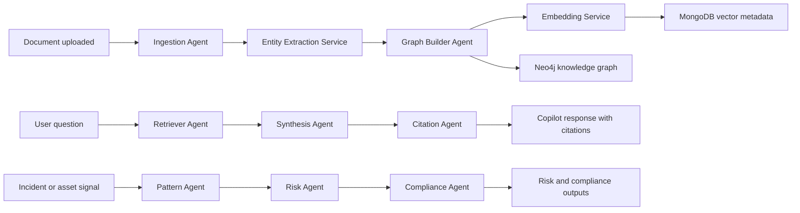

# LangGraph Workflow Architecture

## Primary Workflows

## Agent Responsibilities

| Agent | Responsibility | Future tools |
| --- | --- | --- |
| Ingestion Agent | normalize uploaded document workflow | parsers, OCR, chunker |
| Graph Builder Agent | convert extracted entities into graph writes | entity resolver, relationship linker |
| Retriever Agent | retrieve relevant chunks and graph context | vector search, graph traversal |
| Synthesis Agent | draft grounded answers | Gemini, context compressor |
| Citation Agent | verify and format evidence | citation resolver, source span validator |
| Pattern Agent | detect recurring operational patterns | incident clustering, trend analysis |
| Risk Agent | score and explain risk | bowtie model, consequence estimator |
| Compliance Agent | map evidence to requirements | standards library, control mapper |

